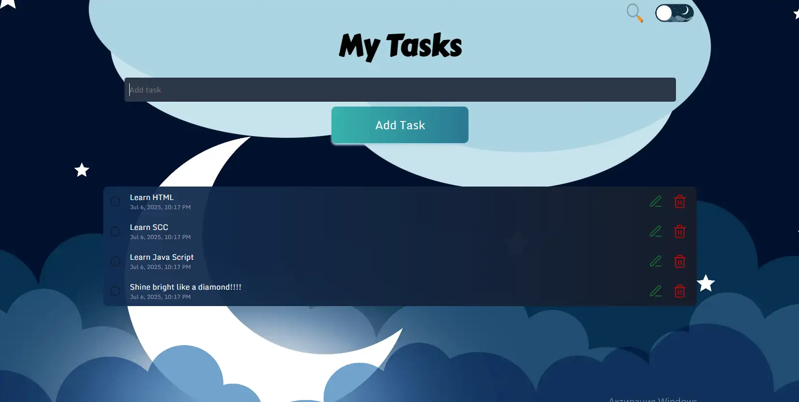

<h1> <a href="https://maxim-belyi.github.io/to-do/" target="_blank">
✅ My Tasks: To-Do List App 📝 </a> </h1>
 
 

  

 
 
Интерактивное веб-приложение для управления задачами (To-Do list).
 
Проект позволяет добавлять, редактировать, удалять и отмечать выполненные задачи. Для удобства реализован функционал поиска по списку дел, а также переключение между светлой и темной темой оформления. Проект демонстрирует работу с DOM-деревом и управление состоянием на стороне клиента.
 
 

 
### 🛠️ Стек технологий

 
### ⚙️ Установка и локальный запуск

Для работы с проектом убедитесь, что у вас установлен Node.js (v16 или выше).

Клонируйте репозиторий:

Generated bash
git clone https://github.com/Maxim-Belyi/to-do.git

Перейдите в папку проекта:

Generated bash
cd to-do
IGNORE_WHEN_COPYING_START
content_copy
download
Use code with caution.
Bash
IGNORE_WHEN_COPYING_END

Установите зависимости:

Generated bash
npm install
IGNORE_WHEN_COPYING_START
content_copy
download
Use code with caution.
Bash
IGNORE_WHEN_COPYING_END

Запустите сервер для разработки:
Эта команда запустит локальный сервер. Сайт будет доступен по адресу, который появится в терминале.

Generated bash
npm run dev
IGNORE_WHEN_COPYING_START
content_copy
download
Use code with caution.
Bash
IGNORE_WHEN_COPYING_END

